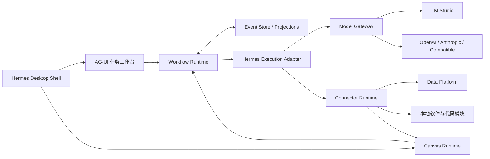

# Hermes 本地多 Agent 工作台设计规格

日期：2026-08-05  
状态：待用户审阅  
目标平台：macOS 个人本地桌面应用

## 1. 结论

在 Hermes Agent 之上建设独立的 Agent Operating Layer：Hermes 继续负责 Agent Loop、Skills、Terminal、Browser 和桌面壳；新建持久化 Workflow、多 Agent 状态、人机与监督介入、Mission/Epoch、模型网关、Connector、AG-UI、Canvas、Artifact 和 Event Store。

核心技术原则：

- Hermes 是执行运行时，不是持久化任务状态的事实来源。
- Workflow Runtime 是 Mission、Run、Step、AgentRun、审批和恢复状态的唯一事实来源。
- Domain Event 是内部事实；AG-UI 是面向前端的投影协议。
- Mission 可以永续，Run 必须有界，Epoch 负责周期封存和上下文压缩。
- Agent 拥有独立上下文；项目共享上下文通过版本化提议更新。
- 人工介入和 Supervisor 纠偏都是一等输入，但通过不同权限策略处理。
- Connector 提供软件通信能力，Skill 提供完成任务的程序性知识。
- Canvas 独立承载图形、图片、音频和交互式 Artifact。

## 2. 产品范围

### 2.1 目标

- 单用户、本机优先的 macOS Electron 应用。
- 使用 LM Studio 作为默认本地模型运行时。
- 支持 OpenAI、Anthropic 及兼容格式的云模型 Provider。
- 支持小时级任务在应用退出和重启后恢复。
- 支持一个项目中的多个 Agent、独立上下文、共享上下文和持久化 Handoff。
- 允许用户在任务运行中多次补充、纠正、暂停和要求重规划。
- 由独立 Supervisor Agent 持续发现偏差、提出纠偏并触发验证。
- 通过 Mission/Epoch 支持可长期持续运行的任务。
- 通过 API/SDK 和浏览器 CDP 双通道调试本地 Data Platform。
- 允许生成的代码产物通过 Connector 与其他软件模块通信。
- 通过独立 Canvas 渲染文本之外的图形、图片、音频和交互内容。

### 2.2 暂不建设

- 企业多租户、复杂 RBAC、计费系统和组织级审计平台。
- Kafka、Redis、分布式事务和跨数据中心一致性。
- 复杂 DLP、全量数据分类和企业 Connector 签名体系。
- 通用任意网站自动化和自动执行生产环境删除。
- Skill 市场和自动启用未知 Skill。

### 2.3 个人本地版底线

- API Key、Token 和密码只保存于 macOS Keychain 或本地环境，不进入代码、数据库、Checkpoint 或 Artifact。
- 删除与不可逆操作始终需要用户确认。
- Agent 生成的 HTML 在沙盒中渲染，不获得 Node/Electron 权限。
- Connector 停止时必须回收托管子进程。
- 生成代码默认在独立工作目录运行。

## 3. 总体架构



### 3.1 Hermes 内部改动

- Electron 增加任务工作台和 Canvas 入口。
- 原有执行事件接入 Hermes Execution Adapter。
- 普通聊天可升级为持久化 Mission。
- 设置页增加模型、Connector 和工作区配置。
- 保留 Hermes Skills 目录和原有 CLI、TUI、Gateway 行为。

### 3.2 独立模块

```text
packages/
├── workflow-runtime
├── event-store
├── model-gateway
├── hermes-adapter
├── connector-runtime
├── data-platform-connector
├── canvas-runtime
├── agui-gateway
├── artifact-store
├── supervisor-runtime
└── shared-protocol
```

独立模块通过稳定协议通信，不直接依赖 Hermes 大型核心文件的内部对象。

## 4. 生命周期与状态模型

```text
Project
└── Mission
    ├── MissionPolicy
    ├── MissionContext
    ├── AgentTeam
    ├── Epoch
    │   └── Run
    │       ├── ExecutionGraph
    │       ├── AgentRun
    │       ├── Step
    │       ├── Attempt
    │       ├── Handoff
    │       ├── Intervention
    │       ├── Approval
    │       ├── Checkpoint
    │       └── Event
    ├── Supervisor
    ├── Schedules
    ├── Watchers
    └── StateExtensions
```

### 4.1 生命周期边界

| 层级 | 生命周期 | 作用 |
|---|---|---|
| Project | 长期 | 项目知识、资源和配置 |
| Mission | 永续 | 持续目标、监督和运行策略 |
| Epoch | 小时或天级 | 可封存的工作周期 |
| Run | 分钟或小时级 | 有明确边界的一次执行 |
| Step/Attempt | 秒或分钟级 | 具体操作与重试 |

Mission 没有普通完成终态。用户确认终止后才进入 `terminated`。

### 4.2 Mission 核心状态

```text
created → active ↔ idle
             ↕ waiting
             ↕ paused
             → degraded → recovering → active / needs_human
             → migrating → active
             → archived → active / terminated
```

核心状态保持少而稳定；领域和插件状态使用 `reason_code` 与扩展命名空间表达。

### 4.3 Run 状态

```text
queued → running → completed
             ├── waiting_approval → running
             ├── paused → running
             ├── retrying → running
             ├── reconciliation_required
             ├── failed → running
             └── cancelled
```

## 5. 永续运行与扩展状态机

### 5.1 Epoch 轮转

满足以下任一条件时封存 Epoch：

- 达到时间窗口或事件数量上限。
- 上下文或存储达到阈值。
- 阶段目标完成或发生重大人工介入。
- Execution Graph 大幅重构。
- Schema、模型、Skill 或组件需要升级。

封存时生成 EpochSummary，包含完成事项、未完成事项、当前事实、外部状态、重要介入、监督发现、Artifact 引用和下一周期建议。

### 5.2 扩展状态

```json
{
  "core_state": "waiting",
  "reason_code": "data_platform.job_running",
  "extensions": {
    "data_platform": {"job_id": "job-42", "phase": "computing"},
    "supervisor": {"health": "normal"}
  },
  "schema_version": 3
}
```

ExtensionManifest 声明自有状态命名空间、接受和发出的事件、迁移 Guard、恢复处理器和健康检查。扩展只能写自己的命名空间，核心迁移必须由 Workflow Runtime执行。

### 5.3 长期可靠性

- 活动 Run、AgentRun、Watcher 和 ModuleInstance 持有 Lease 与 Heartbeat。
- Watchdog 检查进程和租约；Supervisor 检查质量；Health Monitor 检查外部依赖。
- 采用并发、调用频率、Event 队列、Artifact、token 和费用限制实现 Backpressure。
- Schema 使用版本、Upcaster、投影重建和 Epoch 边界迁移。

## 6. 多 Agent 上下文与协作

### 6.1 三层上下文

- Agent Private Context：角色、目标、私有消息、草稿、Tool 历史和 Agent Checkpoint。
- Run Shared Context：计划、中间发现、依赖输出、外部任务 ID 和待处理问题。
- Project Context：已验证事实、Schema、业务规则、架构决策、调试经验和长期 Artifact。

ContextResolver 按角色、当前 Step、依赖节点、标签、权限和 token 预算构建 AgentContextPackage，不向每个 Agent 注入完整项目历史。

### 6.2 Handoff

Handoff 是结构化、持久化对象，包含发送方、接收方、目标、输入引用、期望输出 Schema 和状态。

```text
created → accepted → running → delivered → acknowledged
                       └──────→ failed
```

所有动态子任务必须先写入 Execution Graph，再启动 Agent。Hermes 进程内委派不是事实来源。

### 6.3 共享上下文写入

Agent 通过“提议—验证—提交”更新 Project Context。条目记录来源、置信度、有效期、状态和 `base_version`。冲突产生 `context_conflict`，禁止最后写入者无条件覆盖。

## 7. 人工持续介入

Intervention 独立于 Approval，支持补充信息、纠正事实、调整约束、要求重规划、暂停、跳过、重试和取消。

作用域可以是指定 Agent、Step、Run 或 Project。每次介入记录上下文基线版本、投递策略和处理状态。

```text
submitted → queued → applied → acknowledged
                   ├── needs_clarification
                   ├── rejected
                   └── replan_required
```

介入在安全点应用。文本生成和规划可以立即暂停；SQL 提交、文件写入和其他副作用操作必须等待完成、取消确认或超时对账。

每个 Agent 保存 `observed_context_version` 与 `observed_intervention_sequence`。最终提交前必须确认所有相关介入已处理。

## 8. Supervisor 与持续完善

Orchestrator 推动执行；Worker 执行；Verifier 验证产物；Supervisor 独立观察目标偏移、执行异常、结果质量、基本权限和资源效率。

Supervisor 不能直接修改 Execution Graph 或调用 Worker，只能提交带证据的 Machine Intervention Proposal。Workflow Runtime 根据策略在安全点应用。

```text
Observe → Detect → Diagnose → Propose → Policy Check
→ Apply at Safe Point → Verify → Continue / Escalate
```

Supervisor 可以请求验证、标记结果未验证、暂停受影响分支和请求局部重规划；不能删除数据、扩大权限、修改用户核心目标或无限创建 Agent。

默认限制：单 Step 最多纠偏两次、单 Epoch 最多重规划三次；重复失败后进入 `needs_human_decision`。

## 9. 模型网关

### 9.1 本地模型

LM Studio 是默认本地 Provider，通过本机 OpenAI-compatible API提供流式输出、Tool Calling、Responses/Chat Completions、Embedding、模型发现和健康检查。

未来可以注册 Ollama、MLX Runtime 和 llama.cpp，而不改变 Agent 接口。

### 9.2 云模型

保留三种主要协议：

- OpenAI Responses API
- OpenAI Chat Completions
- Anthropic Messages API

Provider Profile 支持自定义 Base URL、Header、模型别名、能力声明、健康检查和失败回退。配置作用域依次为应用、Project、Mission、Agent 和 Step。

云模型授权支持“本次允许”和“该 Mission 允许”。运行中的 AgentRun 固定实际 Provider、Model 和 Skill 版本。

## 10. Skills

复用 Hermes Skills，并为每个 Skill 增加版本、输入输出 Schema、依赖、权限、兼容性和信任级别。Skill 权限是 Skill、Agent、Mission 和用户策略权限的交集。

运行中升级 Skill 只对新 AgentRun 或新 Epoch 生效。自动生成或下载的 Skill 需经过静态检查、依赖检查、隔离测试和用户启用。

## 11. Connector Runtime

Connector 提供与外部软件通信的稳定能力，首期支持：

- MCP stdio 与 Streamable HTTP
- REST/OpenAPI
- WebSocket
- 本地进程 stdin/stdout
- 本地 HTTP 回调
- 文件和目录监听
- Unix Domain Socket

Connector Manifest 声明传输、能力、输入输出 Schema、健康检查和重连策略。Connector 生命周期为 `installed → configured → connecting → ready → degraded → reconnecting → stopped`。

长调用形成独立 ConnectorCall。AgentRun 可进入等待，Connector 通过 progress/completed/failed 事件恢复 Agent，不占用模型会话。

### 11.1 生成代码模块

代码产物形成 ExecutableArtifact，声明入口、运行时、依赖、输入输出 Schema 和 Connector Binding。运行时实例使用 Lease、健康检查和 generation 防止旧进程继续写入当前状态。

## 12. Data Platform 双通道

DataPlatformPort 提供项目、数据集、Schema、查询、任务、日志、取消、结果预览和浏览器定位等领域操作。

- API/SDK 通道负责稳定的结构化操作。
- Browser/CDP 通道负责连接已登录页面、观察 UI 错误、定位页面对象和 API 缺失时兜底。

每个操作声明是否只读、是否有副作用、幂等性、取消、恢复、超时和对账方式。删除与不可逆操作固定为 `approval: always_required`。

## 13. Canvas Runtime

Canvas 由 Renderer Registry、Artifact Store、Layout Engine、Interaction Bridge 和 Export Service组成。

首期支持 Markdown、HTML、图片、Mermaid、Vega-Lite/ECharts、音频、JSON、表格、代码 Artifact 和 Run Graph。AG-UI 只传递 Artifact 引用，不传大型二进制内容。

Canvas 交互如图表选区、图片批注和音频时间点问题会转换为 Human Intervention。布局保存结构和 Renderer View State，不保存 DOM；音频恢复播放位置但不自动播放。

## 14. 统一事件流

内部 Domain Event 与 AG-UI 分离。所有事件使用版本化 Envelope，包含项目、Mission、Epoch、Run、AgentRun、Step、sequence、causation 和 correlation。

Command 先经过权限、状态、幂等和安全点检查，再生成 Event。Event Store 采用 append-only；Mission、Run、Agent、Connector、Canvas、Approval 和 AG-UI 使用独立投影。

内部交付保证至少一次，消费者通过 event_id 去重并持久化游标。Epoch 边界保存投影快照，避免启动时重放全部历史。

## 15. Artifact 与可复现性

SQL、Schema、日志、请求摘要、截图、查询结果、代码、音频、诊断报告和验证结论保存为 Artifact。数据库只保存索引、元数据和引用，大文件存放于本地 Artifact 目录。

重要结论必须引用 Artifact。Artifact 缺失时显示引用失效，不由 Agent重建或伪造。

## 16. 故障与恢复

| 故障 | 默认策略 |
|---|---|
| LM Studio 未启动 | Mission 等待并引导启动 |
| 模型异常 | 同模型重试一次，再使用备用 Provider |
| Connector 短暂断开 | 指数退避重连 |
| Connector 长期不可用 | 暂停受影响分支 |
| Agent 崩溃 | 从 Agent Checkpoint 恢复 |
| 应用崩溃 | 通过 Lease、Event 和 Checkpoint 恢复 |
| Tool 超时 | 取消或对账后再决定重试 |
| 副作用结果未知 | 进入 reconciliation_required |
| Renderer 失败 | 通用 Artifact 预览 |
| Supervisor 循环 | 达到预算后交给用户 |
| Artifact 丢失 | 标记引用失效 |

恢复顺序：加载 Project Context、恢复 Mission/Epoch/Execution Graph、对账外部副作用、恢复 Agent Mailbox 和游标、重建 Connector/Module、恢复 Canvas 投影，然后启动可继续节点。

## 17. 技术选择

| 组件 | 首期选择 |
|---|---|
| 桌面端 | Hermes Electron + React |
| Workflow | LangGraph 或满足同等契约的独立 Runtime |
| Event/Checkpoint | SQLite WAL |
| Artifact | 本地目录 |
| 本地模型 | LM Studio |
| 云模型 | OpenAI、Anthropic 和兼容 Provider |
| UI 协议 | AG-UI Gateway |
| Canvas | React Renderer Registry |
| Connector | MCP、REST、WebSocket、本地进程 |
| 浏览器 | CDP/Playwright Adapter |

LangGraph 是首选实现，不是外部协议。Workflow Runtime 必须通过内部契约隔离，未来可替换。

## 18. 测试与验收

测试包括状态迁移、事件 Upcaster、上下文合并、Command 幂等、Provider 转换、Connector/Renderer 契约、恢复、故障注入和 24 至 72 小时长稳测试。

MVP 验收场景：

1. 自动发现 LM Studio 并完成 Tool Calling。
2. 配置并切换 OpenAI、Anthropic 和兼容 Provider。
3. 多 Agent 任务持续运行两小时以上。
4. Agent 具有独立上下文并共享版本化 Project Context。
5. 用户三次介入均被相关 Agent确认和应用。
6. Supervisor 触发验证和局部重规划。
7. 强制退出后恢复 Mission、Agent、Connector 和 Canvas。
8. Data Platform 通过 API执行、浏览器观察。
9. 生成代码模块通过 Connector 被调用。
10. Canvas 展示文本、图表、图片和音频。
11. Epoch 轮转后 Mission 继续且上下文不无限增长。
12. 重复 Command/Event 不产生重复副作用。
13. 删除和不可逆操作始终要求确认。

## 19. 实施阶段

### Phase 0：技术验证，2～3 人周

验证 Hermes 事件与取消、LM Studio Tool Calling、Step 边界恢复、AG-UI 映射、Data Platform 双通道和 Electron Canvas 隔离。

### Phase 1：单 Agent 可恢复 MVP，4～6 人周

实现 Project/Mission/Epoch/Run、Event Store、Checkpoint、模型 Provider、人工介入、AG-UI、基础 Canvas 和 Data Platform Connector。

### Phase 2：多 Agent 与监督，4～6 人周

实现独立上下文、共享上下文、Execution Graph、Handoff/Mailbox、Supervisor、Verifier、局部重规划和 Epoch 轮转。

### Phase 3：Connector 与多模态，4～6 人周

实现 Connector Runtime、生成代码托管、WebSocket/File/Process Connector、图形与音频 Renderer、Canvas 双向交互和 Artifact 版本。

### Phase 4：永续与稳定性，3～5 人周

实现 Lease、Watchdog、Health Monitor、故障注入、迁移、Backpressure、长稳测试和恢复中心。

总工作量预估为 17～26 人周。

## 20. Phase 0 决策门

以下问题必须在全面开发前得到验证：

1. Hermes 是否能在 Step 边界稳定恢复。
2. Hermes 事件是否完整表达 Tool、Agent、进度和取消。
3. 目标 LM Studio 模型的 Tool Calling 质量是否满足要求。
4. Hermes 会话状态与 Workflow 状态是否能保持单一所有权。
5. Electron Canvas 沙盒是否兼容现有桌面结构。
6. Data Platform 是否有稳定对象 ID 用于 API 与页面关联。
7. macOS 托管代码模块是否能可靠回收和恢复。
8. SQLite 在长期事件增长下是否能稳定快照和封存。

若 AgentRun 无法细粒度恢复，MVP 明确退化为 Step 边界恢复，不承诺 token 生成中恢复。

## 21. 一致性约束

- UI、Hermes 和 Workflow Runtime 不得分别维护可写的任务事实。
- Supervisor、Verifier 和 Worker 不得共享不可追踪的隐式状态。
- Agent 或扩展不得绕过 Workflow Runtime 直接产生长期后台任务。
- Project Context 只接受带来源、版本和验证状态的结构化条目。
- Canvas 是 Artifact 的交互视图，不是任务事实来源。
- 永续 Mission 不能通过长期授权绕过不可逆操作确认。
- 每个副作用操作必须具有幂等键或明确的恢复对账策略。

