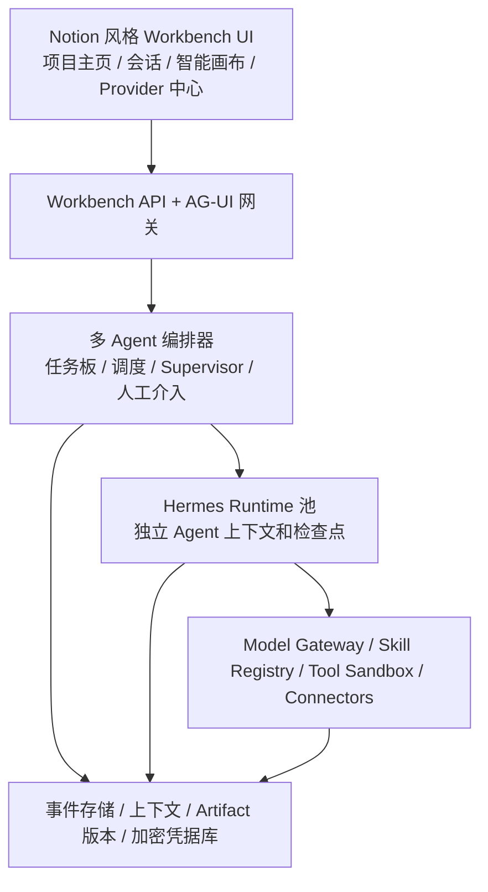
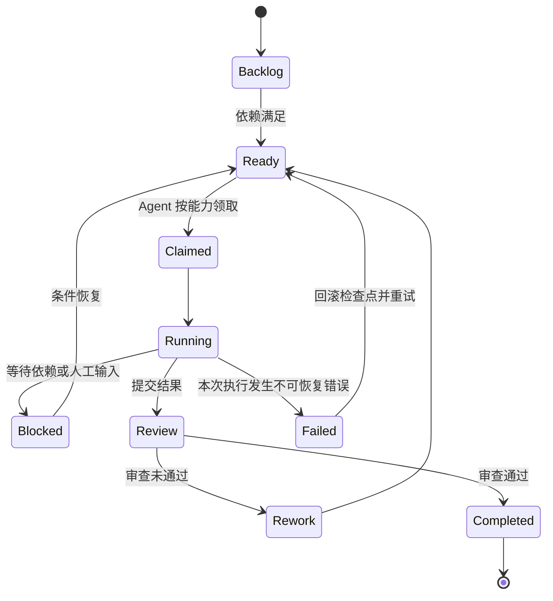
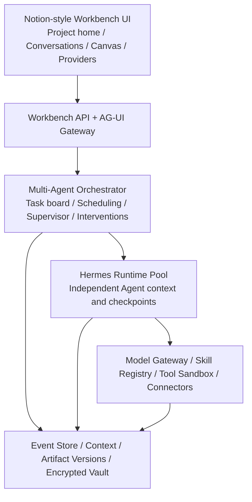
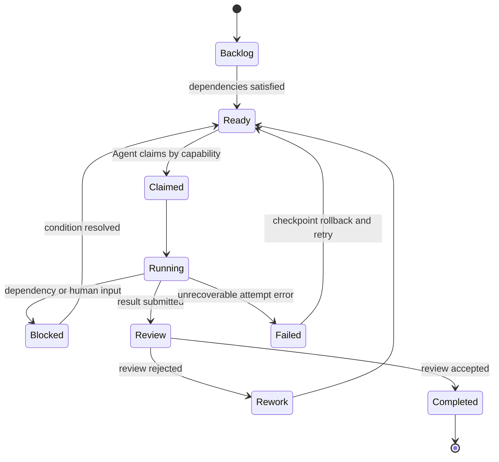

# 混合多 Agent 工作台设计 / Hybrid Multi-Agent Workbench Design

**Date:** 2026-08-06

**Status:** Approved design, pending implementation plan

**Target:** Post-Phase-1 interactive multi-agent test release

**语言 / Languages:** 中文、English

---

# 中文版

## 1. 目标

构建一个可在本地运行、跨平台的 Agent 工作台，支持真实的本地及云端模型会话、自由组建多 Agent 团队、Agent 独立上下文持久化、项目共享上下文、长期自治任务、多次人工介入、动态监督、Skills、受控工具、Data Platform 集成、AG-UI 事件输出，以及带版本管理的多模态 Artifacts。

下一版本不能仅凭探针或后端测试通过验收，必须提供由 UI 驱动的完整端到端测试体验。

## 2. 已确认的产品决策

- 用户可自由创建 Agent、指定角色和模型并组建团队。
- Agent 通过共享任务板协作，可以自主领取、拆分和委派工作。
- 首批真实 Provider 为 LM Studio 和启用 thinking 模式的 DeepSeek V4 Flash。
- Provider 架构同时预留原生 OpenAI-compatible、Anthropic 和 Gemini 适配器。
- 任务可以无限持续运行。时间、Token、费用和循环次数保持可见，但不会自动终止 Mission。
- 当系统检测到循环、重复失败、缺少进展、上下文问题或质量不足时，动态选举或创建 Supervisor。
- 创建任务时进行一次范围授权，单次工具调用不再重复确认；Agent 不能扩大已授权的工作区、工具、Skills、连接器或外部系统范围。
- 共享 Artifact 使用不可变版本、编辑锁、冲突检测、比较、合并、发布和回退机制。
- 桌面 UI 采用 Notion 风格，项目主页和会话工作区分为独立页面。
- 凭据存入应用自有、跨平台的加密凭据库，通过用户主密码解锁，不依赖操作系统 Keychain。

## 3. 架构

系统将控制平面与 Agent 执行平面分离：

### 3.1 Workbench 控制平面

Workbench 管理项目、Mission、共享任务板、授权范围、Agent 定义、Agent Session、人工介入、监督、事件流、恢复、共享事实和 Artifact 发布。

### 3.2 Hermes 执行平面

每个 Agent 通过隔离的 Hermes Runtime 运行。Hermes 负责单个 Agent 的模型及工具循环，但不直接管理项目级调度或其他 Agent 的状态。Workbench 与 Hermes 通过窄接口、版本化的执行协议通信。

### 3.3 统一服务

Model Gateway 统一 Provider 请求、文本流、工具调用、用量、错误和 reasoning 元数据。Skill Registry 提供固定版本的 Skill 包。Tool Sandbox 与 Connectors 执行任务创建时确定的授权范围。

## 4. 持久化领域模型

- `Project`：工作区、项目规则、授权边界和共享事实。
- `AgentDefinition`：身份、角色、模型配置、Skills、工具及能力标签。
- `AgentSession`：单个 Agent 的私有消息历史、模型上下文、检查点和状态。
- `Mission`：可跨重启和多次 Run 持续存在的用户目标。
- `Task`：共享任务板中的执行单元，包含依赖、优先级、领取者、委派、审查和返工状态。
- `Run`：Task 的一次执行尝试。
- `Intervention`：运行中追加的、带版本的人类或 Supervisor 修正。
- `ProjectFact`：Agent 明确发布至项目共享上下文的版本化事实。
- `Artifact`：共享成果稳定的逻辑身份。
- `ArtifactVersion`：包含来源 Agent、Task、父版本、内容哈希和发布状态的不可变内容版本。

Agent 原始对话不会被隐式复制到项目共享上下文。Agent 通过任务消息、已发布 Project Facts 和已发布 Artifact 版本协作。

## 5. 任务板与多 Agent 调度

Agent 根据能力标签、模型能力、当前上下文负载和依赖状态领取工作。Agent 可以创建并委派子任务，但不能扩大任务授权。所有领取和状态转换均使用幂等命令及乐观并发检查。

## 6. 上下文与人工介入语义

UI 提供项目公共时间线，并为每个 Agent 提供独立持久化线程。

- 公共时间线包含任务分配、委派、状态变化、关键结论、人工介入、Artifact 发布、审查和告警。
- Agent 线程包含该 Agent 的消息、模型回复、决策摘要、工具调用、证据和检查点。
- 用户可以在项目、Task 或 Agent 范围内进行任意次数的介入。
- 每次介入创建新的上下文版本，并在下一个安全步骤边界生效。
- 历史消息与事件只追加、不改写。
- 不暴露原始隐藏思维链；UI 展示简洁的决策摘要和可验证的工具证据。

## 7. 动态 Supervisor

编排器检测以下情况：

- 使用等价输入重复调用同一工具；
- 连续失败或没有可衡量的进展；
- Agent 之间循环委派；
- 上下文接近 Provider 限制；
- Artifact 冲突长期未解决；
- 声称完成但缺少证据或未通过验收检查。

系统随后选举合适的可用 Agent，或创建临时 Supervisor。Supervisor 将诊断写入公共时间线，并可要求自我修正、重新分配工作、切换 Agent 模型、重建子任务或回滚检查点。Supervisor 不能扩大授权。如果仍无法恢复，则升级给用户，同时保持 Mission 可恢复。

## 8. 模型供应商中心

Provider 中心参考 CC Switch 中有价值的配置管理理念，但仅服务于 Workbench 内部：

- Provider 预设和自定义端点；
- 协议和认证类型；
- 模型发现与模型别名；
- 连接测试、启用/停用、默认选择和按 Agent 绑定；
- Provider 专用兼容能力；
- 仅显示掩码后的凭据状态，不回显明文。

### 8.1 首批真实 Provider

LM Studio 通过本地 OpenAI-compatible 模型端点自动发现。

DeepSeek 使用：

- Base URL：`https://api.deepseek.com`；
- 模型：`deepseek-v4-flash`；
- `thinking.type = enabled`；
- 默认 `reasoning_effort = high`，可配置为 `max`；
- thinking 模式下不发送 temperature、top-p、presence-penalty 或 frequency-penalty；
- 工具调用后续轮次必须保留并回传 `reasoning_content`；
- thinking 模式下不发送不受支持的 `tool_choice` 字段。

OpenAI-compatible、Anthropic 和 Gemini 仍为一等 Provider 协议，但首个测试版本不要求完成它们的真实凭据验收。

### 8.2 加密凭据库

应用使用用户主密码和内存硬 KDF 派生密钥，对凭据库进行加密。Provider 元数据与加密后的密钥材料分开保存。解密密钥仅在凭据库解锁期间存在于进程内存中。密钥不得进入源码、Git、日志、普通设置文件、Artifact 元数据、事件载荷或业务数据表。

只有在 UI 和凭据库准备好进行真实联调时，系统才请求 DeepSeek API Key。首选流程是在应用内直接输入，而不是在聊天中发送。

## 9. 用户界面

### 9.1 项目主页

项目主页包括全局导航、Mission 与 Task 摘要、当前 Agent 团队、最近 Artifacts、项目事实、Provider 健康状态、待人工介入事项、失败、循环告警和冲突通知，并提供新建任务与组建 Agent 团队的直接入口。

### 9.2 会话工作区

会话页采用可调整宽度、可折叠的三段式布局：

1. 左侧：项目会话、任务状态、Agent 列表及 Agent 线程切换。
2. 中间：公共时间线或选定 Agent 线程、AG-UI 流式消息、决策、工具证据、步骤、审查事件和带作用域的人工介入输入框。
3. 右侧：Artifacts 智能画布，支持文档、表格、JSON、图形、音频、运行图、版本、比较、合并、发布和回退。

每条 Agent 消息均显示 Agent 身份、角色、Provider、模型、执行状态及相关委派关系。Provider 状态、首 Token 延迟、Token 用量和累计费用保持可见，但不设置自动限制。

## 10. 执行、恢复与幂等

每次模型请求、工具调用、任务转换、人工介入、Project Fact 和 Artifact 发布都会形成可重放的领域事件。每个 Agent 在安全步骤边界保存自己的检查点。

重启后，Workbench 依次恢复项目事件流、共享任务板、Agent Sessions、公共时间线、Artifact 版本以及可恢复的 Hermes Runtimes。对于结果未知的外部写操作，系统不会盲目重放，而是通过幂等键查询，确认已有结果或执行预定义补偿。

任务不会因时间、Token、费用或循环阈值自动停止，这些数据仅用于观察。Mission 只会因用户明确终止、完成条件得到验证，或发生已升级但仍保持可恢复的不可恢复故障而结束。

## 11. 交付批次

1. **Provider 中心：** 加密凭据库、LM Studio 模型发现、DeepSeek V4 Flash thinking 配置、连接测试和模型切换。
2. **真实单 Agent 会话：** 替换 Idle Runner，连接 Hermes 与 Model Gateway，持久化消息，输出 AG-UI 流并连接 Canvas。
3. **自由组队：** Agent 独立 Session、共享任务板、自主领取与委派、公共时间线，以及至少四个 Agent 并发。
4. **Artifacts 与真实工具：** 受控工作区文件及命令、Skills、Data Platform 读写、版本、锁、冲突和回退。
5. **监督与恢复：** 动态 Supervisor、循环检测、返工、重新分配、模型切换、检查点回滚和进程重启恢复。

如果某个批次没有可从 UI 操作其后端行为的完整路径，则该批次不能通过验收。

## 12. 最终发布门禁

下一测试版本必须通过一个真实端到端场景：

1. 创建至少四个 Agent，混合使用 LM Studio 和 DeepSeek V4 Flash thinking 配置。
2. 并发执行受控工作区和 Data Platform 的真实写操作。
3. 自主领取、拆分、建立依赖并委派共享任务板中的 Tasks。
4. 创建相互冲突的 Artifact 版本，并演示比较、合并和回退。
5. 使用云端 Agent 审查本地 Agent 的结果并触发返工。
6. Mission 持续运行期间至少接受两次人工介入。
7. 检测模拟循环并通过动态 Supervisor 恢复。
8. 强制结束应用后，恢复所有 Agent 私有上下文、项目共享上下文、Tasks、时间线和 Artifacts。
9. UI 全程显示 Agent、模型、步骤、状态、工具证据、委派和介入信息。
10. 源码、Git 跟踪文件、日志、普通配置、事件和业务数据库全部通过凭据泄漏检查。

仅通过后端探针或单元测试明确不足以通过发布门禁。

## 13. 首个测试版本不包含的范围

- OpenAI、Anthropic 或 Gemini 凭据的强制真实联调。
- 操作系统专属凭据存储。
- 根据 Token、费用、时间或循环预算自动停止。
- 不受限制的文件系统、Shell 或外部系统访问。
- 暴露原始隐藏思维链。
- 企业级多用户授权、合规或复杂安全策略。

---

# English Version

## 1. Objective

Build a locally runnable, cross-platform Agent workbench that supports real local
and cloud model conversations, freely composed multi-Agent teams, persistent
independent Agent contexts, project-shared context, long-running autonomous
tasks, repeated human intervention, dynamic supervision, Skills, controlled
tools, Data Platform integration, AG-UI event output, and versioned multimodal
Artifacts.

The next release is not accepted merely because probes or backend tests pass. It
must provide a complete UI-driven, end-to-end test experience.

## 2. Confirmed Product Decisions

- Users freely create Agents, assign roles and models, and form teams.
- Agents coordinate through a shared task board and may autonomously claim,
  split, and delegate work.
- The first real providers are LM Studio and DeepSeek V4 Flash in thinking mode.
- Provider architecture also reserves native OpenAI-compatible, Anthropic, and
  Gemini adapters.
- Tasks may run indefinitely. Time, token, cost, and loop counters remain visible
  but do not automatically stop a Mission.
- A dynamic Supervisor is elected or created when the system detects loops,
  repeated failure, lack of progress, context problems, or insufficient quality.
- A task receives one scoped authorization at creation time. Individual tool
  calls do not require repeated confirmation, but Agents cannot expand the
  authorized workspace, tools, Skills, connectors, or external systems.
- Shared Artifacts use immutable versions, editing locks, conflict detection,
  comparison, merging, publishing, and rollback.
- The desktop UI is Notion-inspired. The project home and conversation workspace
  are separate screens.
- Credentials are stored in an application-owned, cross-platform encrypted vault
  unlocked with a user master password. No operating-system keychain dependency
  is permitted.

## 3. Architecture

The system separates control-plane responsibilities from Agent execution:

### 3.1 Workbench control plane

Workbench owns projects, Missions, the shared task board, authorization scopes,
Agent definitions, Agent sessions, interventions, supervision, event streaming,
recovery, shared facts, and Artifact publication.

### 3.2 Hermes execution plane

Each Agent runs through an isolated Hermes Runtime. Hermes performs the model and
tool loop for one Agent but does not directly own project-wide scheduling or the
state of other Agents. Workbench and Hermes communicate through a narrow,
versioned execution protocol.

### 3.3 Unified services

Model Gateway normalizes provider requests, streamed text, tool calls, usage,
errors, and reasoning metadata. Skill Registry supplies pinned Skill packages.
Tool Sandbox and Connectors enforce the authorization scope assigned when a task
is created.

## 4. Persistent Domain Model

- `Project`: workspace, project rules, authorization boundaries, and shared facts.
- `AgentDefinition`: identity, role, model profile, Skills, tools, and capability
  labels.
- `AgentSession`: private message history, model context, checkpoints, and status
  for one Agent.
- `Mission`: a durable user objective that may span restarts and many Runs.
- `Task`: a shared-board unit with dependencies, priority, claimant, delegation,
  review, and rework state.
- `Run`: one execution attempt for a Task.
- `Intervention`: a versioned human or Supervisor correction appended during a
  running Mission.
- `ProjectFact`: a versioned fact explicitly published from an Agent session to
  shared project context.
- `Artifact`: stable logical identity for a shared output.
- `ArtifactVersion`: immutable content version with source Agent, Task, parent
  version, content hash, and publication state.

Raw Agent conversations are never implicitly copied into project-shared context.
Agents collaborate through task messages, published Project Facts, and published
Artifact versions.

## 5. Task Board and Multi-Agent Scheduling

Agents claim work according to capability labels, model capability, current
context load, and dependency readiness. They may create and delegate subtasks but
cannot extend task authorization. All claims and transitions use idempotent
commands and optimistic concurrency checks.

## 6. Context and Intervention Semantics

The UI provides a project public timeline and a separate persistent thread for
each Agent.

- The public timeline contains assignments, delegation, status changes, key
  conclusions, interventions, Artifact publications, reviews, and alerts.
- Agent threads contain that Agent's messages, model responses, decision
  summaries, tool calls, evidence, and checkpoints.
- Users may intervene at project, Task, or Agent scope any number of times.
- Every intervention creates a new context version and becomes active at the next
  safe step boundary.
- Historical messages and events are append-only and are not rewritten.
- Raw hidden chain-of-thought is not exposed. The UI presents concise decision
  summaries and verifiable tool evidence.

## 7. Dynamic Supervisor

The orchestrator detects:

- repeated tool calls with equivalent inputs;
- consecutive failures or lack of measurable progress;
- circular delegation between Agents;
- context approaching provider limits;
- unresolved Artifact conflicts;
- completion claims without evidence or passing acceptance checks.

It then elects a suitable available Agent or creates a temporary Supervisor. The
Supervisor records its diagnosis on the public timeline and may request
self-correction, reassign work, switch the Agent's model, rebuild subtasks, or
roll back to a checkpoint. It cannot broaden authorization. If recovery remains
impossible, it escalates to the user while preserving the Mission as resumable.

## 8. Model Provider Center

The provider center follows the useful configuration-management concepts of CC
Switch while remaining internal to Workbench:

- provider presets and custom endpoints;
- protocol and authentication type;
- model discovery and curated model aliases;
- connection testing, enable/disable, default selection, and per-Agent binding;
- provider-specific compatibility capabilities;
- masked credential status without plaintext redisplay.

### 8.1 Initial real providers

LM Studio is discovered through its local OpenAI-compatible model endpoint.

DeepSeek uses:

- base URL `https://api.deepseek.com`;
- model `deepseek-v4-flash`;
- `thinking.type = enabled`;
- `reasoning_effort = high` by default, configurable to `max`;
- no temperature, top-p, presence-penalty, or frequency-penalty fields in
  thinking mode;
- preservation and replay of `reasoning_content` for tool-call continuation;
- no unsupported `tool_choice` field in thinking mode.

OpenAI-compatible, Anthropic, and Gemini remain first-class provider protocols,
but their live credential acceptance is not required for the first test release.

### 8.2 Encrypted credential vault

The application creates a vault encrypted with a key derived from the user's
master password using a memory-hard KDF. Provider metadata is stored separately
from encrypted secret material. The decrypted key exists only in process memory
while the vault is unlocked. Secrets must never enter source code, Git, logs,
ordinary settings files, Artifact metadata, event payloads, or business tables.

The implementation will request the DeepSeek API key only when the UI and vault
are ready for live integration. The preferred flow is direct entry into the
application, not sending the key in chat.

## 9. User Interface

### 9.1 Project home

The project home contains global navigation, Mission and task summaries, the
current Agent team, recent Artifacts, project facts, provider health, pending
human interventions, failures, loop alerts, and conflict notifications. It
provides direct actions for creating a task and assembling an Agent team.

### 9.2 Conversation workspace

The conversation screen is a resizable and collapsible three-pane workspace:

1. Left: project conversations, task status, Agent list, and Agent-thread switcher.
2. Center: public timeline or selected Agent thread, AG-UI streaming messages,
   decisions, tool evidence, steps, review events, and scoped intervention input.
3. Right: intelligent Artifact Canvas for documents, tables, JSON, graphs, audio,
   run graphs, versions, comparison, merging, publication, and rollback.

Every Agent message shows Agent identity, role, provider, model, execution status,
and relevant delegation relationship. Provider status, first-token latency, token
usage, and accumulated cost remain visible without enforcing automatic limits.

## 10. Execution, Recovery, and Idempotency

Every model request, tool call, task transition, intervention, Project Fact, and
Artifact publication becomes a replayable domain event. Each Agent saves its own
checkpoint at safe step boundaries.

On restart, Workbench restores the project event stream, shared task board, Agent
sessions, public timeline, Artifact versions, and then resumable Hermes Runtimes.
An external write whose result is unknown is not blindly repeated: the system
queries its idempotency key and either confirms the prior result or performs a
defined compensation.

Tasks do not stop because of time, token, cost, or loop thresholds. Those values
remain observable. A Mission ends only through explicit user termination,
verified completion criteria, or an unrecoverable failure that remains resumable
after escalation.

## 11. Delivery Batches

1. **Provider center:** encrypted vault, LM Studio discovery, DeepSeek V4 Flash
   thinking profile, model connection tests and switching.
2. **Real single-Agent conversation:** replace the idle runner, connect Hermes to
   Model Gateway, persist messages, stream AG-UI output, and connect Canvas.
3. **Free-form teams:** independent Agent sessions, shared task board, autonomous
   claim/delegation, public timeline, and four-or-more-Agent concurrency.
4. **Artifacts and real tools:** controlled workspace files and commands, Skills,
   Data Platform reads and writes, versioning, locking, conflict and rollback.
5. **Supervision and recovery:** dynamic Supervisor, loop detection, rework,
   reassignment, model switching, checkpoint rollback, and process-restart
   recovery.

No batch is accepted without an operable UI path through its backend behavior.

## 12. Final Release Gate

The next test version must pass one real end-to-end scenario that:

1. creates at least four Agents using a mixture of LM Studio and DeepSeek V4
   Flash thinking profiles;
2. executes concurrent controlled-workspace and Data Platform real write actions;
3. autonomously claims, splits, depends on, and delegates shared-board Tasks;
4. creates conflicting Artifact versions and demonstrates comparison, merge, and
   rollback;
5. uses a cloud Agent to review local-Agent output and trigger rework;
6. accepts at least two human interventions while the Mission continues;
7. detects a simulated loop and recovers through a dynamic Supervisor;
8. survives forced application termination and restores all Agent-private
   contexts, project-shared context, Tasks, timelines, and Artifacts;
9. displays Agent, model, step, state, tool evidence, delegation, and intervention
   information throughout the UI;
10. passes automated credential-leak checks across source, Git-tracked files,
    logs, ordinary configuration, events, and business databases.

Passing backend probes or unit tests alone is explicitly insufficient.

## 13. Out of Scope for the First Test Release

- Mandatory live validation of OpenAI, Anthropic, or Gemini credentials.
- Operating-system-specific credential stores.
- Automatic stopping based on token, cost, time, or loop budgets.
- Unrestricted filesystem, shell, or external-system access.
- Exposure of raw hidden chain-of-thought.
- Enterprise multi-user authorization, compliance, or complex security policy.
