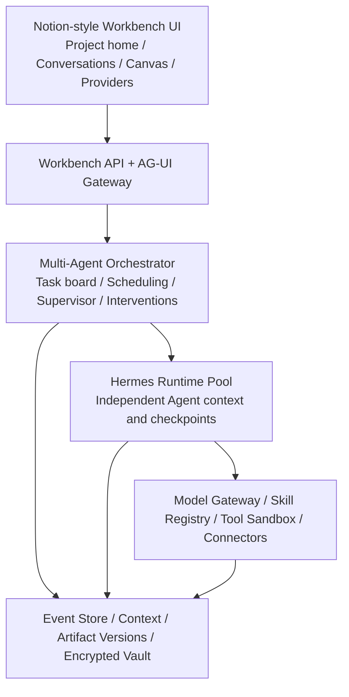
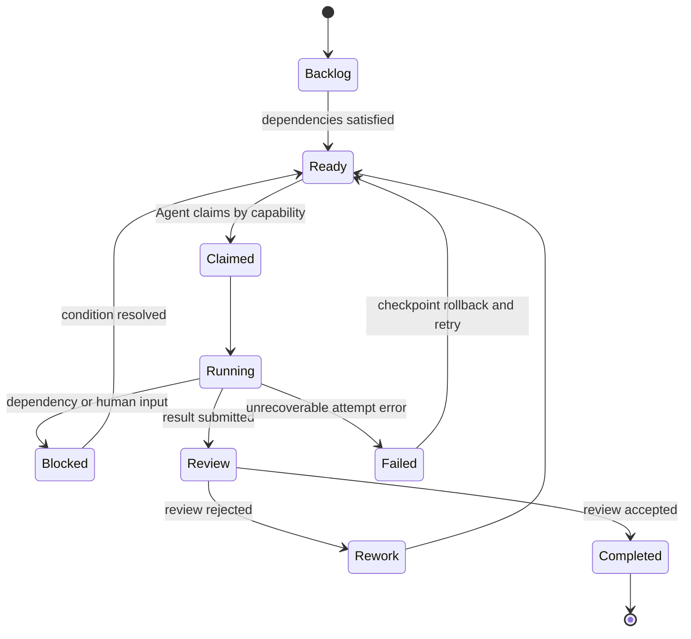

# Hybrid Multi-Agent Workbench Design

**Date:** 2026-08-06

**Status:** Approved design, pending implementation plan

**Target:** Post-Phase-1 interactive multi-agent test release

## 1. Objective

Build a locally runnable, cross-platform Agent workbench that supports real local
and cloud model conversations, freely composed multi-Agent teams, persistent
independent Agent contexts, project-shared context, long-running autonomous
tasks, repeated human intervention, dynamic supervision, Skills, controlled
tools, Data Platform integration, AG-UI event output, and versioned multimodal
Artifacts.

The next release is not accepted merely because probes or backend tests pass. It
must provide a complete UI-driven, end-to-end test experience.

## 2. Confirmed Product Decisions

- Users freely create Agents, assign roles and models, and form teams.
- Agents coordinate through a shared task board and may autonomously claim,
  split, and delegate work.
- The first real providers are LM Studio and DeepSeek V4 Flash in thinking mode.
- Provider architecture also reserves native OpenAI-compatible, Anthropic, and
  Gemini adapters.
- Tasks may run indefinitely. Time, token, cost, and loop counters remain visible
  but do not automatically stop a Mission.
- A dynamic Supervisor is elected or created when the system detects loops,
  repeated failure, lack of progress, context problems, or insufficient quality.
- A task receives one scoped authorization at creation time. Individual tool
  calls do not require repeated confirmation, but Agents cannot expand the
  authorized workspace, tools, Skills, connectors, or external systems.
- Shared Artifacts use immutable versions, editing locks, conflict detection,
  comparison, merging, publishing, and rollback.
- The desktop UI is Notion-inspired. The project home and conversation workspace
  are separate screens.
- Credentials are stored in an application-owned, cross-platform encrypted vault
  unlocked with a user master password. No operating-system keychain dependency
  is permitted.

## 3. Architecture

The system separates control-plane responsibilities from Agent execution:

### 3.1 Workbench control plane

Workbench owns projects, Missions, the shared task board, authorization scopes,
Agent definitions, Agent sessions, interventions, supervision, event streaming,
recovery, shared facts, and Artifact publication.

### 3.2 Hermes execution plane

Each Agent runs through an isolated Hermes Runtime. Hermes performs the model and
tool loop for one Agent but does not directly own project-wide scheduling or the
state of other Agents. Workbench and Hermes communicate through a narrow,
versioned execution protocol.

### 3.3 Unified services

Model Gateway normalizes provider requests, streamed text, tool calls, usage,
errors, and reasoning metadata. Skill Registry supplies pinned Skill packages.
Tool Sandbox and Connectors enforce the authorization scope assigned when a task
is created.

## 4. Persistent Domain Model

- `Project`: workspace, project rules, authorization boundaries, and shared facts.
- `AgentDefinition`: identity, role, model profile, Skills, tools, and capability
  labels.
- `AgentSession`: private message history, model context, checkpoints, and status
  for one Agent.
- `Mission`: a durable user objective that may span restarts and many Runs.
- `Task`: a shared-board unit with dependencies, priority, claimant, delegation,
  review, and rework state.
- `Run`: one execution attempt for a Task.
- `Intervention`: a versioned human or Supervisor correction appended during a
  running Mission.
- `ProjectFact`: a versioned fact explicitly published from an Agent session to
  shared project context.
- `Artifact`: stable logical identity for a shared output.
- `ArtifactVersion`: immutable content version with source Agent, Task, parent
  version, content hash, and publication state.

Raw Agent conversations are never implicitly copied into project-shared context.
Agents collaborate through task messages, published Project Facts, and published
Artifact versions.

## 5. Task Board and Multi-Agent Scheduling

Agents claim work according to capability labels, model capability, current
context load, and dependency readiness. They may create and delegate subtasks but
cannot extend task authorization. All claims and transitions use idempotent
commands and optimistic concurrency checks.

## 6. Context and Intervention Semantics

The UI provides a project public timeline and a separate persistent thread for
each Agent.

- The public timeline contains assignments, delegation, status changes, key
  conclusions, interventions, Artifact publications, reviews, and alerts.
- Agent threads contain that Agent's messages, model responses, decision
  summaries, tool calls, evidence, and checkpoints.
- Users may intervene at project, Task, or Agent scope any number of times.
- Every intervention creates a new context version and becomes active at the next
  safe step boundary.
- Historical messages and events are append-only and are not rewritten.
- Raw hidden chain-of-thought is not exposed. The UI presents concise decision
  summaries and verifiable tool evidence.

## 7. Dynamic Supervisor

The orchestrator detects:

- repeated tool calls with equivalent inputs;
- consecutive failures or lack of measurable progress;
- circular delegation between Agents;
- context approaching provider limits;
- unresolved Artifact conflicts;
- completion claims without evidence or passing acceptance checks.

It then elects a suitable available Agent or creates a temporary Supervisor. The
Supervisor records its diagnosis on the public timeline and may request
self-correction, reassign work, switch the Agent's model, rebuild subtasks, or
roll back to a checkpoint. It cannot broaden authorization. If recovery remains
impossible, it escalates to the user while preserving the Mission as resumable.

## 8. Model Provider Center

The provider center follows the useful configuration-management concepts of CC
Switch while remaining internal to Workbench:

- provider presets and custom endpoints;
- protocol and authentication type;
- model discovery and curated model aliases;
- connection testing, enable/disable, default selection, and per-Agent binding;
- provider-specific compatibility capabilities;
- masked credential status without plaintext redisplay.

### 8.1 Initial real providers

LM Studio is discovered through its local OpenAI-compatible model endpoint.

DeepSeek uses:

- base URL `https://api.deepseek.com`;
- model `deepseek-v4-flash`;
- `thinking.type = enabled`;
- `reasoning_effort = high` by default, configurable to `max`;
- no temperature, top-p, presence-penalty, or frequency-penalty fields in
  thinking mode;
- preservation and replay of `reasoning_content` for tool-call continuation;
- no unsupported `tool_choice` field in thinking mode.

OpenAI-compatible, Anthropic, and Gemini remain first-class provider protocols,
but their live credential acceptance is not required for the first test release.

### 8.2 Encrypted credential vault

The application creates a vault encrypted with a key derived from the user's
master password using a memory-hard KDF. Provider metadata is stored separately
from encrypted secret material. The decrypted key exists only in process memory
while the vault is unlocked. Secrets must never enter source code, Git, logs,
ordinary settings files, Artifact metadata, event payloads, or business tables.

The implementation will request the DeepSeek API key only when the UI and vault
are ready for live integration. The preferred flow is direct entry into the
application, not sending the key in chat.

## 9. User Interface

### 9.1 Project home

The project home contains global navigation, Mission and task summaries, the
current Agent team, recent Artifacts, project facts, provider health, pending
human interventions, failures, loop alerts, and conflict notifications. It
provides direct actions for creating a task and assembling an Agent team.

### 9.2 Conversation workspace

The conversation screen is a resizable and collapsible three-pane workspace:

1. Left: project conversations, task status, Agent list, and Agent-thread switcher.
2. Center: public timeline or selected Agent thread, AG-UI streaming messages,
   decisions, tool evidence, steps, review events, and scoped intervention input.
3. Right: intelligent Artifact Canvas for documents, tables, JSON, graphs, audio,
   run graphs, versions, comparison, merging, publication, and rollback.

Every Agent message shows Agent identity, role, provider, model, execution status,
and relevant delegation relationship. Provider status, first-token latency, token
usage, and accumulated cost remain visible without enforcing automatic limits.

## 10. Execution, Recovery, and Idempotency

Every model request, tool call, task transition, intervention, Project Fact, and
Artifact publication becomes a replayable domain event. Each Agent saves its own
checkpoint at safe step boundaries.

On restart, Workbench restores the project event stream, shared task board, Agent
sessions, public timeline, Artifact versions, and then resumable Hermes Runtimes.
An external write whose result is unknown is not blindly repeated: the system
queries its idempotency key and either confirms the prior result or performs a
defined compensation.

Tasks do not stop because of time, token, cost, or loop thresholds. Those values
remain observable. A Mission ends only through explicit user termination,
verified completion criteria, or an unrecoverable failure that remains resumable
after escalation.

## 11. Delivery Batches

1. **Provider center:** encrypted vault, LM Studio discovery, DeepSeek V4 Flash
   thinking profile, model connection tests and switching.
2. **Real single-Agent conversation:** replace the idle runner, connect Hermes to
   Model Gateway, persist messages, stream AG-UI output, and connect Canvas.
3. **Free-form teams:** independent Agent sessions, shared task board, autonomous
   claim/delegation, public timeline, and four-or-more-Agent concurrency.
4. **Artifacts and real tools:** controlled workspace files and commands, Skills,
   Data Platform reads and writes, versioning, locking, conflict and rollback.
5. **Supervision and recovery:** dynamic Supervisor, loop detection, rework,
   reassignment, model switching, checkpoint rollback, and process-restart
   recovery.

No batch is accepted without an operable UI path through its backend behavior.

## 12. Final Release Gate

The next test version must pass one real end-to-end scenario that:

1. creates at least four Agents using a mixture of LM Studio and DeepSeek V4
   Flash thinking profiles;
2. executes concurrent controlled-workspace and Data Platform real write actions;
3. autonomously claims, splits, depends on, and delegates shared-board Tasks;
4. creates conflicting Artifact versions and demonstrates comparison, merge, and
   rollback;
5. uses a cloud Agent to review local-Agent output and trigger rework;
6. accepts at least two human interventions while the Mission continues;
7. detects a simulated loop and recovers through a dynamic Supervisor;
8. survives forced application termination and restores all Agent-private
   contexts, project-shared context, Tasks, timelines, and Artifacts;
9. displays Agent, model, step, state, tool evidence, delegation, and intervention
   information throughout the UI;
10. passes automated credential-leak checks across source, Git-tracked files,
    logs, ordinary configuration, events, and business databases.

Passing backend probes or unit tests alone is explicitly insufficient.

## 13. Out of Scope for the First Test Release

- Mandatory live validation of OpenAI, Anthropic, or Gemini credentials.
- Operating-system-specific credential stores.
- Automatic stopping based on token, cost, time, or loop budgets.
- Unrestricted filesystem, shell, or external-system access.
- Exposure of raw hidden chain-of-thought.
- Enterprise multi-user authorization, compliance, or complex security policy.
