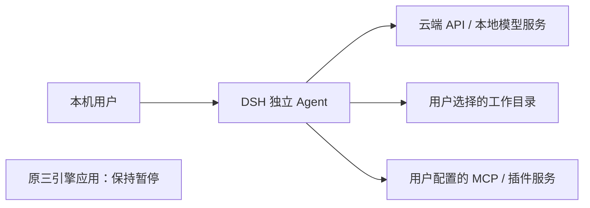
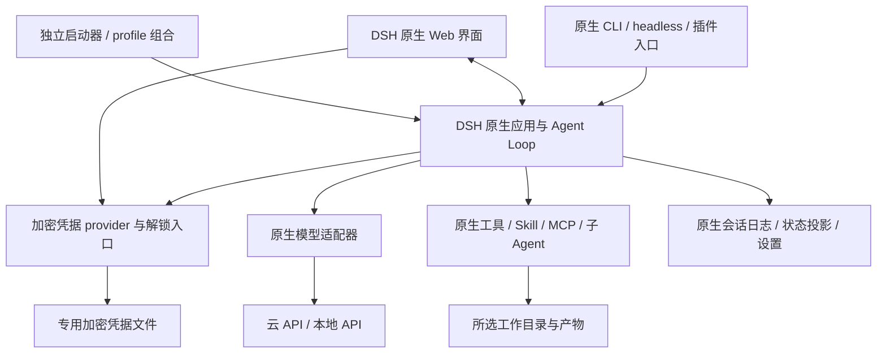
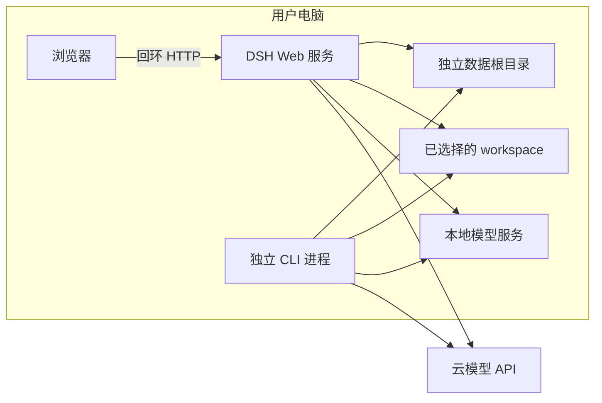

# DSH 独立 Agent 设计

日期：2026-09-08

状态：用户已确认并授权实施；Task 1–3 已实现并通过任务审查，Task 4 交付工程与测试已实现、待最终审查。网页环境已启动，本地模型工具闭环通过；云模型及完整原生能力验收尚未完成。

## BUSINESS POSTURE — 目标与范围

直接复用已引入的 DeepSeek Harness 原生运行时、Web 应用和 CLI/profile/plugin 体系，交付一个用户能自行配置模型、选择工作目录、连续对话和执行任务的独立 Agent。新开发不经过现有三引擎控制面，不重写一套聊天界面或精简版执行循环。

工作分支为 `codex/dsh-standalone-agent`，工作目录为 `/Users/sushi/Downloads/Johnason-Agent/.worktrees/dsh-standalone-agent`，起点为提交 `618865a`。旧工作区及其未提交内容继续保留并暂停，不纳入本次改动，也不删除旧实现。

### 功能一致的定义

基线是仓库已锁定的 DSH 提交 `b150a551b8d465e31e418e1b2eaf5e79bbb7d28e`，对应 CLI 包版本 `0.1.1-rc.2`。不自动追踪最新上游，也不把上游可选组件、第三方账户权限或未实测功能表述为已经可用。

功能一致指复用该版本正式 Web/headless profile 的能力组合、工具和会话语义，并验证下面的主要用户路径。为满足本项目凭据要求，唯一计划替换的基础实现是凭据存储 provider；补充独立启动、安装文档和密码录入入口。原生执行循环、事件、会话格式和插件机制保持不变。

| 方案 | 内容 | 决策 |
|---|---|---|
| 原生应用加薄适配层 | 复用 DSH Web、CLI、profile 与插件；新增独立启动和加密凭据 provider | 采用，减少重复实现和运行语义差异 |
| 基于 SDK 重建网页 | 自建会话、工具审批、状态、恢复界面 | 本轮不做，重复建设范围大 |
| 扩充现有 Host sidecar | 沿用旧控制面、准入与运行时转换 | 本轮不做，不符合独立 Agent 目标 |

### 范围边界

- Web 是主要人机入口；CLI 提供原生 headless 任务执行、profile 选择和插件管理入口。
- TUI 是可选 profile/plugin，不承诺默认安装后就有终端聊天界面；命令行插件不等于 Codex 桌面应用插件。
- 原生子 Agent、计划、Skill、MCP 等能力照原有组合接入，不移植旧产品经理/架构师角色编排、三模式选择或跨模式接力。
- 不迁移旧 Vault、会话、历史排队任务、验收准入证据和模型默认值；用户在新页面配置。旧历史任务不得因启动本应用而执行。
- 首轮提供本地 Web 应用，不提供公网托管、多人账户、桌面安装包或云工作空间调度；不增加仅为演示的静态聊天和模拟产物。

## SECURITY POSTURE — 必要约束

security control：用户输入的 API Key、OAuth/授权记录和密码不进入代码、普通配置、浏览器持久化或日志。凭据以专用加密数据文件保存，配置只保留引用；主密码不落盘。

security control：保持上游只写密钥表单和脱敏描述接口，使用 DSH `ctx.credentials` 服务替换默认明文 provider，不先写 `.credentials.yaml` 再加密。不使用项目或用户 `.env` 作为本应用凭据回退来源，也不自动继承旧应用凭据。

security control：新数据目录与旧应用及默认 `~/.dsh` 分离；Web 默认只监听回环地址。用户先选工作目录再执行任务，沿用 DSH 原生工具审批，不私自开自动批准。

accepted risk：原生工具执行和插件安装拥有用户授予的本机权限；加密落盘不等于隔离同用户恶意进程、插件或被攻陷的服务端内存。本轮不宣称具备远程多租户安全性。

accepted risk：DSH 为开发预览版本，会话格式及插件 API 可能破坏兼容；通过固定版本和升级前副本验证控制风险，不做隐式迁移。

按用户要求不在每轮实施额外全库安全扫描；新增功能进行必要正确性测试，交付前单独执行一次安全检查与限定测试目录内的漏洞/故障注入验证。

## DESIGN — 架构

### C4 CONTEXT — 系统关系

| Name | Type | Description | Responsibilities | Security controls |
|---|---|---|---|---|
| 本机用户 | Person | Web 或 CLI 操作者 | 选择工作目录、模型、批准操作 | 明确执行意图 |
| DSH 独立 Agent | System | 固定版本原生 DSH 与薄适配 | 对话、执行、状态、持久化 | 本地监听、凭据加密 |
| 模型服务 | External system | DeepSeek 等云 API 或 LM Studio 等兼容服务 | 推理和工具调用建议 | 运行时解析凭据 |
| 工作目录 | External storage | 用户明确选择的文件目录 | 输入文件和实际输出 | 原生文件与工具权限策略 |
| MCP / 插件服务 | External system | 可选扩展 | 提供额外工具或交互 | 用户主动配置，保留原生审批 |
| 原三引擎应用 | Separate system | 不被新入口启动 | 保留旧开发进度 | 无自动数据共享 |

### C4 CONTAINER — 组件与数据流

| Name | Type | Description | Responsibilities | Security controls |
|---|---|---|---|---|
| 独立启动器 | Node.js application | 拟置于 `apps/dsh-agent/` | 版本检查、数据目录、profile、启动和退出 | 不启动旧服务、不以当前仓库自动授权 workspace |
| 原生 Web | React/Vite application | 复用上游构建产物 | 模型、工作目录、会话、审批和运行交互 | 不读取明文密钥 |
| 原生 CLI | Node.js application | 复用 DSH 参数与插件机制 | web/headless/profile/plugin | 无密钥命令行参数或回显 |
| DSH 内核与能力插件 | Runtime | 锁定版本原生组件 | Agent Loop、上下文、事件、工具和子任务 | 原生审批策略 |
| 加密凭据 provider | Cordis plugin | 实现原生 credentials 服务 | 凭据引用和授权记录读写、脱敏状态、锁定 | 加密文件、原子写、跨进程互斥 |
| 解锁入口 | Local UI/API extension | 原生界面的最小补充 | 初始化、解锁、锁定和错误提示 | 密码仅用于当前进程，锁定不清空历史 |
| 状态存储 | Files | DSH 原生会话、设置、投影 | 刷新和重启后的历史恢复 | 不复制旧数据；配置只含凭据引用 |

启动器准备独立 profile，从锁定版本的原生 base patch 生成外置 encrypted-base bundle，只替换 `credentials` 条目的实现与配置；其他条目逐项保持相同，Web/headless 原生模式 bundle 不变。该 pin 的 Cordis patch 中 `name` 只是匹配保护，不能用最终 patch 改插件身份，这是实施核对后的集成修正。最终 overlay 固定加密 provider 配置，启动前验证只挂载一个凭据 provider。不修改 Agent Loop 或上游源码；若组合验证不能证明替换成功，启动失败并说明原因，不降级到明文存储。

用户在 Web 解锁后，通过原生 Models 页面保存密钥。LLM adapter 在每次请求开始解析 `ctx.credentials`，保存后下一次请求生效。Web 与单独 CLI 进程共用加密数据但各自解锁，不能用“文件已经存在”当作解锁成功。CLI 的密码获取采用无回显交互；用户日常配置仍通过网页完成，不要求输入命令配置密钥。

加密 provider 覆盖 `resolve/describe/set/unset` 和 `readRecord/describeRecord/listRecords/modifyRecord/deleteRecord` 两类地址空间，保留更新事件及脱敏语义。授权记录作为不透明 JSON 保存；`modifyRecord` 在跨进程互斥下重新读取、修改并原子提交，防止 Web 和 CLI 同时刷新授权时丢失更新。加密采用 Node 标准密码库的 scrypt 派生与 AES-256-GCM，随机盐和逐次写入随机 nonce，带格式版本；密码错误、数据损坏、未配置凭据、模型错误分开提示，不引导用户因运行失败重置密码。

### C4 DEPLOYMENT — 本地部署

| Name | Type | Description | Responsibilities | Security controls |
|---|---|---|---|---|
| Node 环境 | Runtime host | 上游要求 `^22.19.0` 或 `>=24.0.0` | 执行原生应用 | 启动时版本检查 |
| 构建工具 | Build dependency | 锁定 `pnpm@11.7.0` 和上游 lockfile | 安装、构建、可复现版本 | 不借用旧工作区依赖作为交付条件 |
| Web 服务 | Process | 默认请求使用 3080 回环端口 | 向浏览器提供应用 | 端口占用明确提示，不连入占用端口的未知服务 |
| 独立数据根 | Storage | 默认用户目录下 `.johnason-dsh`，可显式覆盖 | 保存 profile、会话、设置与加密凭据 | 禁止默认落到旧 `.runtime`、旧 Vault 或 `~/.dsh` |
| Workspace | Storage | 用户选择的目录 | 文件读取、编辑、命令执行和产物 | 新网页不预选仓库，CLI 要求显式 workspace |

子进程仅针对本次应用设置 `DSH_HOME`，不修改系统用户目录变量。关闭或重启只管理本次启动的进程。首次交付以当前 Mac 上实际验证为准；实现不依赖 macOS Keychain，Linux/Windows 未实测前标记未验证。

## 能力对齐与用户验收

| 编号 | 能力与入口 | 通过条件 |
|---|---|---|
| D1 | 安装、Web 启动 | 新工作区按文档完成安装构建；浏览器可进入原生界面；不依赖旧 Python/Go 控制面服务 |
| D2 | 配置模型与凭据 | Web 初始化/解锁、保存供应商；云端真实调用成功；适配本地 OpenAI-compatible 服务；失败可区分凭据与模型原因 |
| D3 | 连续会话 | 新建会话发送、流式回复、继续补充；刷新及正常重启后能查看历史并发起下一轮，不自动重跑历史任务 |
| D4 | 实际工具执行 | 在新测试目录创建并修改真实文件、执行无破坏性命令；前台可见工具状态和结果，失败不能显示成成功 |
| D5 | 人机交互 | 实测原生提问/审批、拒绝、运行中中断及后续继续；审批未完成时不越过工具执行 |
| D6 | 计划与上下文 | 实测原生 Plan/Todo、compact 与 goal 路径；核对会话日志和用户显示，不重建旧状态机 |
| D7 | 原生子 Agent | 发起一个可分解任务，看到实际委派、子任务结果与主任务汇总；上下文依照原生语义隔离 |
| D8 | Skill、MCP、插件 | 加载一个测试 Skill、一个本地测试 MCP 工具和一个 CLI profile/bundle 插件；真实调用且可从结果定位来源 |
| D9 | CLI 入口 | 帮助、profile、headless 执行及插件管理可用；headless 输出与会话确实保存；不把仅展示帮助视为执行通过 |
| D10 | 中断与恢复 | 正常重启恢复历史；异常退出按原生会话语义恢复或明确记录中断，不宣称任意进程步骤精确恢复或副作用 exactly-once |
| D11 | 产物路径 | 指令“写一篇约200字小说，再生成动画 HTML”产生真实文件；最终回复提供可访问路径，用户能打开检查，不以固定演示文件代替 |
| D12 | 扩展与独立性 | 启动新应用不改旧 Vault、历史队列或旧会话；记录启用 bundle 清单与版本，逐项标明可选/未验证项 |

真实模型验收至少使用用户在新界面配置的一个云模型；本地服务可用时追加同一任务的本地模型验收，否则明确待人工提供服务，不标通过。不得从聊天历史或旧 Vault 自动取密钥。允许单元测试验证确定性逻辑，但不能用 mock 结果替代 D2–D11 的真实 Agent 验收。付费模型只运行显式发起的新验收；记录每个用例的模型、时间、会话标识、结果及产物，不保存密钥或密码。

### 实施先后关系

1. 独立启动与基线构建：初始化锁定子模块，构建原生 Web/CLI，记录默认插件组合；建立不含旧数据的启动入口。此阶段只验无凭据启动，不录入明文密钥。
2. 加密凭据接入：实现同一原生服务的替换 provider 和最小解锁界面，完成并发写入、锁定、错误分类等定向测试；此后才开放真实模型录入。
3. 原生能力验证与必要适配：Web 连续会话、工具执行、子 Agent、Skill/MCP、CLI/profile/plugin；只修阻碍对齐的适配问题，不新增控制面。
4. 用户交付：完成真实 API 用例、产物检查和一次集中安全检查，生成安装/启动/停机/恢复/测试说明与能力实测清单，提供可直接操作的网页。

阶段结果分别标注“已构建”“本地功能验证通过”“真实模型验收通过”，不以源码存在替代完成。上游能力与本地模型不兼容时先记录原生错误和最小复现，再调整 provider 参数或标明模型限制，不增加统一重试去遮蔽根因。

## RISK ASSESSMENT — 风险与处理

| 风险 | 影响 | 处理 |
|---|---|---|
| 上游 Web/profile 组合被精简 | 用户再遇到有页面无交互 | 使用完整原生组合，保存组合清单并做端到端验收 |
| 原生凭据默认明文 | 违背项目要求 | 同服务替换，不写明文中间文件，不自动载入旧环境 |
| 上游 API 或数据格式变化 | 插件/恢复失效 | 固定提交；升级独立分支验证并保留原数据 |
| DeepSeek 推理/视觉或本地模型兼容差异 | 部分请求失败 | 模型声明与 API 参数按锁定适配器配置，文本/图像能力分别验收，不假定每个模型都有视觉 |
| 原生可选能力需要额外服务 | 误认为默认全部可用 | 明示安装、模型、账户与平台前提；未配置和失败分别记录 |
| 为 UI 重新实现后端 | 工作量膨胀与状态不一致 | 仅适配原生扩展点，禁止再建立并行会话库或旧准入链 |

## QUESTIONS & ASSUMPTIONS — 已确定事项与假设

已确定：暂停旧开发、建立新分支；采用 DSH 原生 Web/CLI/plugin，不经过三引擎控制面；凭据继续加密保存。

本稿采用：本机单用户、独立初始数据、Web 为主要入口、CLI 为补充，先交付源码构建及运行入口；界面保留原生交互结构，新增提示和交付文档以中文为主，不在首轮重画整套中英文 UX。若需要桌面安装包、默认 TUI 或旧数据迁移，另立扩展，不阻挡本轮能力对齐。

### 已核对的源码依据

以下路径相对于仓库，均以本稿锁定子模块提交为准：

- `third_party/deepseek-harness/README.md`：启动、构建、开发预览声明和许可证。
- `third_party/deepseek-harness/apps/cli/README.md`、`apps/cli/package.json`：profile/headless/web/plugin 行为和组件依赖。
- `third_party/deepseek-harness/docs/user/guide/index.md`、`providers.md`：工作目录选择、供应商配置、模型保持与兼容限制。
- `third_party/deepseek-harness/packages/credentials/credentials/README.md`、`src/types.ts`：凭据服务、记录互斥、更新事件和脱敏语义。
- `third_party/deepseek-harness/packages/credentials/credentials-local/README.md`：明文存储及其限制，解释本轮替换原因。
- `third_party/deepseek-harness/packages/bundle/base/cordis.patch.yml`：默认 credentials 插件及原生能力组合。

设计自检：未把旧 sidecar 当作完整 DSH；未承诺跨模式能力、所有平台或任意断点精确恢复；未将真实 API 验收提前标记为通过；新增凭据实现是明确的原生差异点。
